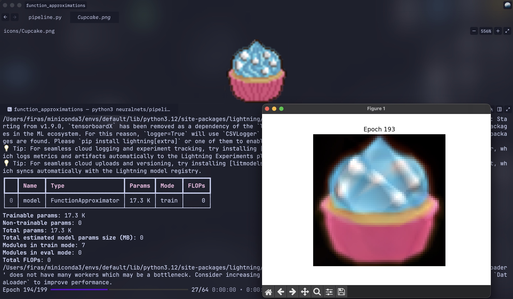

# Function Approximations

A neural network that learns to approximate mathematical functions and images by training a small multilayer perceptron (MLP) to map inputs to outputs — with a **live visualization** that updates every epoch so you can watch the network learn in real time.
---

## Example

```sh
python neuralnets/pipeline.py --image_path icons/Cupcake.png --epochs 200 --learning_rate 5e-3 --batch_size 64 --rgb
```



---

## What It Does

This app has two modes:

### 1. Function Mode
Given any mathematical function `y = f(x)`, the network is trained to learn the mapping from `x` → `y` over the domain `[-10, 10]`. A live plot shows the network's prediction versus the true function at the end of every training epoch.

### 2. Image Mode
Given any image file, the network is trained to learn the mapping from pixel coordinates `(x, y)` → pixel color values. The network essentially learns to "memorize" the image as a continuous function. Supports both **grayscale** and **RGB** color modes, and a live preview updates every epoch showing the reconstructed image as training progresses.

---

## Architecture

The neural network (`FunctionApproximator`) is a simple 3-layer MLP defined in `neuralnets/model.py`:

- **Input layer** → 128 hidden units (ReLU)
- 128 hidden units → 128 hidden units (ReLU)
- 128 hidden units → **Output layer**

For function approximation, input size is `1` and output size is `1`.  
For image approximation, input size is `2` (x, y coordinates) and output size is `1` (grayscale) or `3` (RGB).

Training is handled via [PyTorch Lightning](https://lightning.ai/) with an Adam optimizer and MSE loss.

---

## Requirements

Install the dependencies before running:

```sh
pip install torch lightning numpy matplotlib sympy pillow
```

---

## Usage

Run `pipeline.py` from inside the `neuralnets/` directory:

```sh
cd neuralnets
python pipeline.py [OPTIONS]
```

You must specify **exactly one** of `--function` or `--image_path`.

### Options

| Argument | Type | Default | Description |
|---|---|---|---|
| `--function` | `str` | `None` | Math function to approximate. Must be in the form `"y=f(x)"`. |
| `--image_path` | `str` | `None` | Path to an image file to approximate. |
| `--image_size` | `int` | `64` | Width and height (in pixels) to resize the image to before training. |
| `--rgb` | flag | off | Use RGB (3-channel) output for image mode. Defaults to grayscale. |
| `--epochs` | `int` | `100` | Number of training epochs. |
| `--batch_size` | `int` | `64` | Batch size used during training. |
| `--learning_rate` | `float` | `1e-3` | Learning rate for the Adam optimizer. |

---

## Project Structure

```
function_approximations/
├── neuralnets/
│   ├── model.py       # MLP model definition (FunctionApproximator)
│   └── pipeline.py    # Training pipeline, data loading, and live visualization
└── icons/             # Sample food emoji images to use as approximation targets
```